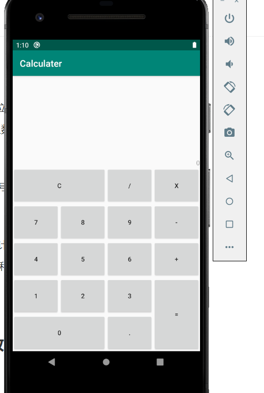
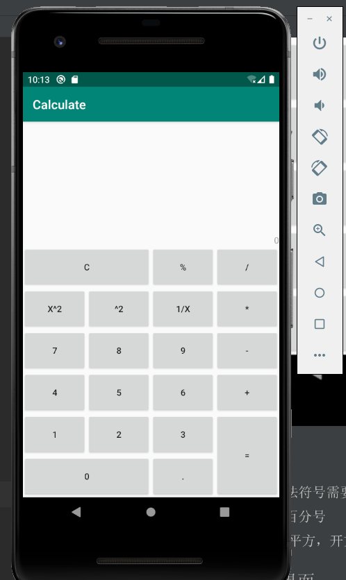
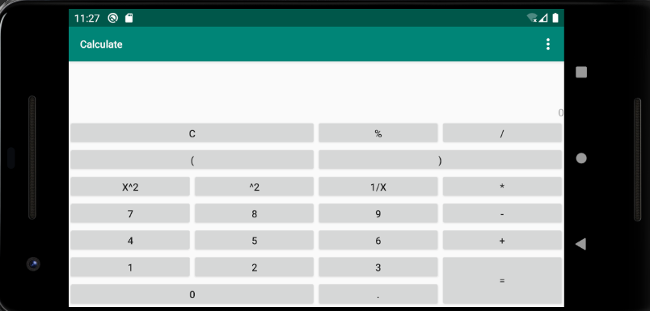

# Caculater

实现安卓计算器功能

##界面

### 第一版界面与改进

#### 改进

- [x] 乘法符号需要修改
- [x] 加百分号
- [x] 加 平方，开方
####修改后界面

- [x] 横屏界面
- [x] 帮助
- [x] 括号

###最终界面

#逻辑规则

##输入判断规则

- [x]  不可   +* +/ ++ +. +)      -+ -* -/ -. -)    *+ */  *.   * )   /+ /* * // /) /.       .+ .- .*  ./ . (  .)     (+ (*  (/  ((  (.    ).   
- [x]  +-*/后面除了-和（其余不能连接在一起
- [x]   .前后只能是数字
- [x] ()不能连在一起
- [x] 括号匹配
- [x] 除法分母不能为0
- [x] -号自动添加括号

###尾位规则

- [ ] 尾位不能为符号

###显示规则

- [ ] 可以显示历史计算，清除后清除显示
- [ ] =计算后显示=和结果

#综合绑定

##显示绑定测试

