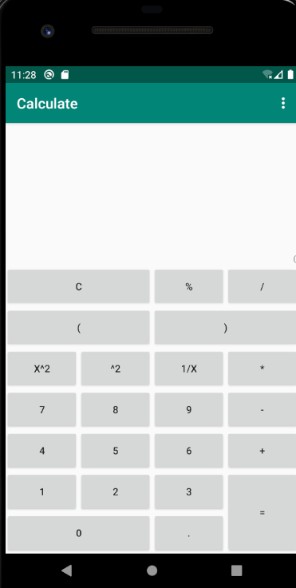
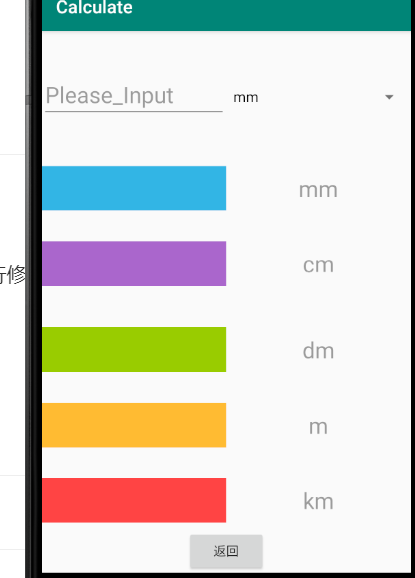
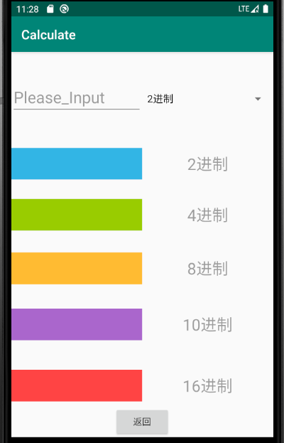
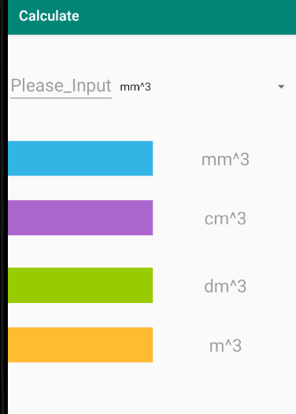

# Caculater

实现安卓计算器功能

##界面

### 第一版界面与改进

#### 改进

- [x] 乘法符号需要修改
- [x] 加百分号
- [x] 加 平方，开方
####修改后界面

- [x] 横屏界面
- [x] 帮助
- [x] 括号

###最终界面

#逻辑规则

##输入判断规则

- [x]  不可   +* +/ ++ +. +)      -+ -* -/ -. -)    *+ */  *.   * )   /+ /* * // /) /.       .+ .- .*  ./ . (  .)     (+ (*  (/  ((  (.    ).   
- [x]  +-*/后面除了-和（其余不能连接在一起
- [x]   .前后只能是数字
- [x] ()不能连在一起
- [x] 括号匹配
- [x] 除法分母不能为0

###显示规则

- [x] 可以显示历史计算，清除后清除显示
- [x] =计算后显示=和结果

##

# 计算规则

通过之前的输入规则输入正确的计算表达式，之后通过后缀表达式来进行计算

# 计算器缺陷/未实现

- 负号的判定和相关自动补充的编写
- 括号补足显示
- 阿里命名规范不是全部地方遵守，之后如果再修改可能会进行修改

# 转化

## 界面

## 实现

- 用户选择通过下拉列表实现，用户的选择通过一个全局变量来记录更新
- 通过edittext改变方法来进行实时转化
- 长度转化通过10的次方进行转化，体积转化同理，进制转化通过以10进制为基础，调用java自身封装好的函数进行转化

## 缺陷

- 对输入没用进行规定和二次检测，存在漏洞，用户输入不符合标准的数程序会出错误，例如二进制输入2
- 界面使用自身设计的一个界面，没有特点和区分
- 用户如果想复制之类的进一步操作没有涉及到